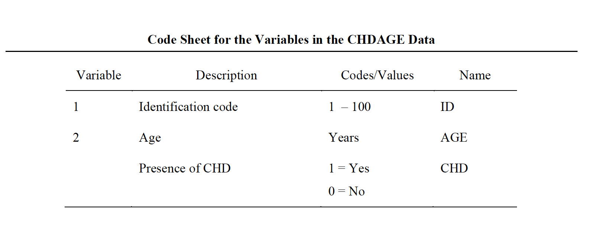
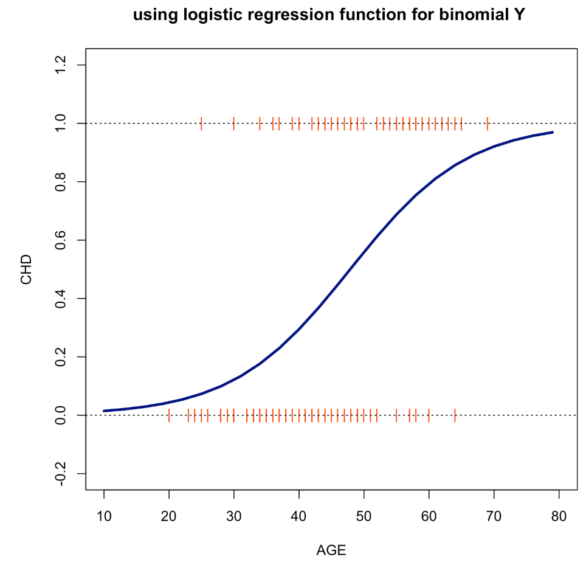

```{r setup, include=FALSE}
options(htmltools.dir.version = FALSE)
knitr::opts_chunk$set(collapse = TRUE,
                      fig.retina = 3)

library(ymlthis)
library(tidyverse)
library(readxl)
library(httr)
library(tidyr)
library(ggplot2)
library(dplyr)
# access ecdc data
```

layout: true

<a class="footer-link" href="http://tatjanakeco.rbind.io/">tatjanakeco.rbind.io</a>

---

class: title-slide, center, bottom

# `r rmarkdown::metadata$title`

## `r rmarkdown::metadata$subtitle`

### `r rmarkdown::metadata$author`


---
class: top, center
background-image: url("images/www.png")
background-size: cover
background-color: #ffffff


---
class: top, center
background-image: url("images/background.png")
background-size: cover
background-color: #ffffff

# .shadow-text[What if my response variable is categorical?]

---
# What is Logistic Regression?

- <span style="color:red">**Logistic regression**</span>  is typically used as an extension of multiple regression, particularly adapted to situations where the dependent response variable, $Y$, is categorical, and independent explanatory variables, $X_i$s, are continuous.

- When categorical $Y$ is dichotomous (2-outcomes): happy or sad

  it is called <span style="color:red">**Binomial**</span> **Logistic Regression**

- When $Y$ has more than two attributes: general, academic and vocational

  it is called <span style="color:red">**Multinomial**</span> **Logistic Regression**   

- When $Y$ categories can be ranked: low, middle, high

  it is called <span style="color:red">**Ordinal**</span> **Logistic Regression**

---
### .emphasis[The Premise of Logistic Regression]

.pull-left[
Logistic Regression is similar to OLS regression with the exception that it is **based on the independent explanatory variables prediction of** <span style="color:red">**probabilities, odds, and the logarithm of the odds**</span>**, for a categorical dependent response variable $Y$**, rather than the prediction of specific values of a quantitative $Y$.
]

.pull-right[
*Example:*
cost of the course ( $X_1$ ) and the number of lab hours ( $X_2$ ) become predictors of the “likelihood” of a dichotomous dependent response variable ( $Y$ ) representing the biochemistry course satisfaction. 

Note, that in a multiple regression analysis we would be predicting a quantitative variable.
]

---
### .emphasis[Probabilities and odds]

Consider the following distribution of the biochemical course satisfaction for 400 students:  

- satisfied = 188 
- not-satisfied = 199

The <span style="color:red">**probability**</span> of being a satisfied student would be simply the number of satisfied students (outcome of interest) expressed as a proportion to the total possible $$P(S) = 188 / 400 =.47$$


The <span style="color:red">**odds**</span> would be the ratio of the probability $P(x)$ to its compliment $(1-P(x))$. Hence, the odds of being a satisfied student would be $$P(S) /(1-P(S)) = .0333/.9667 = .0.0344$$

---
### .emphasis[The logarithm of the odds]

Unlike a linear regression, in which coefficients are easy to interpret, the estimates produced in the logistic model are less intuitive.

The logarithm of the odds ratio is called the <span style="color:red">**logit**</span> and is simply the natural logarithm of the odds of being in that category.

When observing the effect of a unit change in an explanatory variable $X$ on predicting the outcome of $Y$ we use the logit and we interpret it as the ratio of the odds of being classified in one category of the $Y$ for two different values of the $X$.

---
class: top, center
background-image: url("images/confused.png")
background-size: cover
background-color: #ffffff

# .shadow-text[But Why... what is Logistic Regression?]

---
class: top, center
background-image: url("images/example.png")
background-size: cover
background-color: #ffffff

# .shadow-text[Simple,... please!]


---
class: top
background-color: c("#FFFAF0", "#FFFFFF", "#FFFFFF")

### .emphasis[Binomial Logistic Regression: Typical problems]

Often in studies, we encounter <span style="color:red">**outcomes that are not continuous**</span>, but instead <span style="color:red">**fall into 1 of 2 categories**</span>. The dependent response variable only has two categories. Generally, the occurrence of the event is coded as 1 and its absence as 0. In these cases we have binary outcomes, variables that can have only two possible values:

- Measuring a performance labelled as good (1) or bad (0)
- Assessment of the student success as passed (1) or failed (0)
- Risk factor for cancer: person has cancer (1), or does not (0)
- Whether a political candidate is going to win an election: lose (0), win (1) 
- ‘Health’ of a business can be observed by monitoring the solvency of the firm: bankrupt (0), solvent (1)


These are just a few of many examples where logistic regression methods are used to perform the prediction.

---
### .emphasis[How does it work?]

Let us examine one such example using data from [Hosmer, Lemeshow, and Sturdivant (2013)](https://www.wiley.com/en-ie/Applied+Logistic+Regression,+3rd+Edition-p-9780470582473) on the association between age and coronary disease, available from 👉 https://github.com/TanjaKec/mydata/tree/master/CHDAGE.

```{r, echo=FALSE, fig.align='center'}

```

The data contains two variables: the age in years (AGE), and the presence or absence of evidence of significant coronary heart disease (CHD) for 100 subjects in a hypothetical study of risk factors for heart disease.
---
### CHDAGE at first glance

It is of interest to explore the relationship between AGE and the presence or absence of CHD in this group.

It would be very attractive to be able to use the same modelling techniques as for linear models. We are going to do just that: fit a simple linear regression model to examine this relationship to see if it will work.

$$CHD = b_0 + b_1AGE$$
## .emphasis[BUT!!!]

1) linear regression expects a numeric response variable and 

2) we are interested in the analysis of the probability of a presence of CHD based on a person's AGE
---

# Logistic Regression

.pull-left[
The vertical green line represents the age mean: 44,38 years old.

The trend is very clear: as age increases, the number of people diagnosed with coronary disease grows.

- For people above the mean there more cases of illness, while for people below the
mean, the larger concentration is in the 0, “did not develop it”, category.   

]

.pull-right[
```{r echo=FALSE, eval=TRUE}
CHDAGE <- read.csv("data/CHDAGE.csv", header= TRUE)
model_lm = lm(CHD ~  AGE, data = CHDAGE)
# plot a scatter diagram of Y vs X1
plot(CHD ~  AGE, data = CHDAGE, 
     col = "orangered", pch = "|", ylim = c(-0.2, 1.2),
     main = "using linear regression function for binomial Y")
abline(h = 0, lty = 3)
abline(h = 1, lty = 3)
abline(h = 0.5, lty = 2)
abline(v = mean(CHDAGE$AGE), lwd = 3, col = "darkgreen")
abline(model_lm, lwd = 3, col = "navy")
```

]

---
### .emphasis[Glimpse at data]

This summary table clearly shows there is an association between age and coronary disease: the higher the age, the higher the chance of developing coronary diseases.

```{r echo=FALSE, message=FALSE, warning=FALSE}
suppressPackageStartupMessages(library(tidyverse))
suppressPackageStartupMessages(library(dplyr))

CHDAGE <- CHDAGE %>% 
  mutate(
    # Create categories
    Age_group = dplyr::case_when(
      AGE >= 20 & AGE < 30 ~ "20-29",
      AGE >= 30 & AGE < 35 ~ "30-34",
      AGE >= 35 & AGE < 40 ~ "35-39",
      AGE >= 40 & AGE < 45 ~ "40-44",
      AGE >= 45 & AGE < 50 ~ "45-49",
      AGE >= 50 & AGE < 55 ~ "50-54",
      AGE >= 55 & AGE < 60 ~ "55-59",
      AGE >= 60        ~ "60-69"
    ),
  # Convert to factor
  Age_group = factor(
    Age_group,
    level = c("20-29", "30-34","35-39", "40-44", "45-49", "50-54", "55-59", "60-69")
    )
  )

tb1 <- CHDAGE %>%
  group_by(Age_group, CHD) %>%
  summarise(no_cases = n()) %>% 
  pivot_wider(names_from = c(CHD), values_from = no_cases) %>%
  mutate(Total = `0`+`1`) %>% 
  mutate("Yes %" = round(`1`/ `Total` * 100, digits = 0)) 
options(htmltools.preserve.raw = FALSE)
DT::datatable(tb1)
```


---
### .emphasis[Visualisation of data]

.pull-left[
We observe a positive correlation between age (axis X) and the probability of developing cardiac diseases (axis Y). 

We need a regression model that will inform about:

- the direction
- the magnitude and
- the statistical significance level of this relationship
]

.pull-right[
```{r echo=FALSE, eval=TRUE}
tb1 %>% ggplot(aes(x = Age_group, y = tb1$"Yes %", fill = "red")) +
        geom_bar(stat="identity", color = "black") +
        theme(plot.title = element_text(size = 14, vjust = 2, hjust=0.5)) +
        labs (title = "Percentage of people who are ill for each age group", 
              x = "Age group", y = "Coronary Disease (mean)") +
        theme(legend.position="none")
```
]
---
### .emphasis[OLS doesn't work]

As we can see the linear regression model does not work for this type of problem, for which we do not expect predictions that are off-scale values: below zero or above 1.

Apart from the fact that the linear function given is unbounded, and hence cannot be used to model probability, the other assumptions of linear regression when dealing with this type of a problem are also not valid:

- the relationship between $Y$ and $X$ is nonlinear
- error terms are not normally distributed
- the assumption of equal/constant variance (homoscedasticity) does not hold

.emphasis[A workaround these issues is to fit a different model, one that is bounded by the minimum and maximum probabilities. ]

---
### .emphasis[The logistic regression function]

.pull-left[
It makes better sense to <span style="color:red">**model the probabilities on a transformed scale**</span> and this is what is done in <span style="color:red">**logistic regression analysis**</span>. 

The relationship between the probability $p$ and $X$ can be presented by a <span style="color:red">**logistic regression function**</span>.


The shape of the <span style="color:red">**S-curve**</span> given in the figure can be reproduced if we model the probabilities as follows

$$p = P(Y = 1 | X = x) = \frac{e^{\beta_0 + \beta_1x}}{1 + e^{\beta_0 + \beta_1x}},$$

where $e$ is the base of the natural log.
]

.pull-right[
```{r echo=FALSE, eval=TRUE}
lgreg_plot <- glm(CHD ~  AGE, data = CHDAGE, binomial(logit))
x1re_ta <- seq(10, 80, 3)
yx1 <- predict(lgreg_plot, list(AGE = x1re_ta), type="response")

plot(CHD ~  AGE, data = CHDAGE, 
     col = "orangered", pch = "|", ylim = c(-0.2, 1.2), xlim = c(10, 80),
     main = "using logistic regression function for binomial Y ")
abline(h = 0, lty = 3)
abline(h = 1, lty = 3)
abline(v = mean(CHDAGE$AGE), lwd = 3, col = "darkgreen")
lines(x1re_ta, yx1, lty = 1, lwd = 3, col = "navy")
```
]

---
### .emphasis[Mathy part... for those who like it 😁]

The previous equation is called <span style="color:red">**the logistic regression functions**</span>. It is nonlinear in the parameters $\beta_0, \beta_1,... \beta_q$. However, it can be linearised by the **logit transformation**. Instead of working directly with $p$ we work with a transformed value of $p$.

If $p$ is the probability of an event happening, the ratio $\frac{p}{(1-p)}$ is called the <span style="color:red">**odds ratio**</span> for the event.

By moving some terms around $1 - p = P(Y = 1 | X_1 = x_1) = \frac{1}{1 + e^{\beta_0 + \beta_1x_1}},$
we get 

$$\frac{p}{1-p} = e^{\beta_0 + \beta_1x_1}$$
Taking the natural logarithm of both sides of the above expression, we obtain 
$$g(x_1) = log(\frac{p}{1-p}) = \beta_0 + \beta_1x_1$$
where the logarithm of the odds ratio is called the <span style="color:red">**logit**</span>. 

---
### .emphasis[The Generalised Linear Model] 

Generalised linear models (<span style="color:red">GLMs</span>) provide a very powerful and flexible framework for the application of regression models to a variety of non-normal response variables. GLMs consist of three main features:

- **_An error distribution_** giving the distribution of the response around its mean. For analysis of variance and multiple regression this will be the normal; for logistic regression it is the binomial. 

- **_A link function_**, $g$, that shows how the linear function of the explanatory variables is related to the expected value of the response: $g(\mu)=\beta_0 + \beta_1x_1.$
For analysis of variance and multiple regression the link function is simply
the identity function; in logistic regression it is the logit function.

- **_The variance function_** that captures how the variance of the response variable depends on the mean.

Estimation of the parameters in a GLM is usually achieved through a _maximum likelihood_ approach.

---
### .emphasis[Fitting a model]

```
glm(formula = CHD ~ AGE, family = binomial(logit), data = CHDAGE)

Coefficients:
            Estimate Std. Error z value Pr(>|z|)    
(Intercept) -5.30945    1.13365  -4.683 2.82e-06 ***
AGE          0.11092    0.02406   4.610 4.02e-06 ***
```

<div class="flex" style="margin: 0 1em;">
  <div class="column">
    
  </div>
  
---
### .emphasis[Model interpretation]

The fitted logarithm of the odds ratio, i.e. logit of the probability $p$ of the person develop cardiac diseases based on age is:

$$\hat{g}(Age) = -5.31 + 0.11*AGE$$
```{r echo=FALSE, eval=FALSE}
# Unlike a linear regression, in which coefficients are easy to interpret, the estimates produced in the logistic model are less intuitive.

# This is because the logit transformation informs the independent variable’s effect on the variation of the dependent variable’s natural logarithm of the odds.
```

*An increase of 0.11 units is expected in the logit of CHD every time AGE increases by a year.*

```{r echo=FALSE, eval=FALSE}
# This approach’s main disadvantage is its lack of intelligibility. To state that the amount in logitin creased 0.6 units is not very intuitive and does not help to understand the relationship between the variables.
```
We can analyse the AGE's impact on the odds of CHD, by **getting the exponent of the coefficient itself**. In our example, the exponential of $0.11$ is $1.12$. This means that for each additional year, an increase of $1.12$ is expected in the chance of CHD occurring.

```{r echo=FALSE, eval=FALSE}
In a logistic regression, the exponential of a positive value (+) produces a
coefficient larger than 1. Conversely, a negative coefficient (-) returns a Exp(\beta) smaller than 1. A coefficient with a value of zero produces an Exp(\beat) equal to 1, indicating that the independent variable does not affect the chance of the dependent variable’s occurrence. In other words, the farther the coefficient is from one, regardless of the direction, the greater the impact of a given independent variable on the chance of the event of interest occurring
```

Another way of interpreting the parameters is to is to **estimate the percentage increase** in the chance of the occurrence of $Y$. To do so, one must subtract one unit from the exponentiated regression coefficient and multiply the result by 100, in our case (1.12 - 1) * 100. The increase of a year in a person's age is associated with an increase of 12% in the chance of CHD occurring.

```{r echo=FALSE, eval=FALSE}
# The interpretation of the logistic regression’s coefficients may become a little more complicated when the chance is smaller than 1, that is, when the coefficient (\beta) is negative. One solution is to invert the coefficient (1/coefficient’s value), which makes the interpretation easier. For example, a coefficient of 0.11, when inverted, indicates that when the independent variable decreases by in one unit, an average increase of 9.10 is expected in the chance of the dependent variable occurring.

#Lastly, the analyst must validate the results observed with a subsample of its original dataset. This procedure gives the analysis more reliability, especially when working with small samples.
```
---
### .emphasis[Model prediction]

To obtain the predicted probabilities we calculate:

$$\hat{p}(x) =\frac{1}{1 + e^{-(\hat{\beta_0} + \hat{\beta}_1x_1)}}$$
What is our estimated probability of developing coronary diseases at 67 year of age?

$$\hat{p}(x) =\frac{1}{1 + e^{-(-5.31 + 0.11*67)}}=\frac{1}{1 + e^{-(2.06)}}=0.89$$
A sixty seven year old person has a probability of 0.89 of developing coronary diseases.

A tventy seven year old has a probability of 0.09 of developing coronary diseases.


$$\hat{p}(x) =\frac{1}{1 + e^{-(-5.31 + 0.11*27)}}=\frac{1}{1 + e^{-(-2.34)}}=0.09$$

---
### .emphasis[Take Outs]

- Logistic regression is a technique used when the dependent variable is categorical.

- Logistic regression does not assume a linear relationship between the dependent and independent variables: Logistic regression assumes linearity of independent variables and log odds of dependent variable; Homoscedasticity is not required: The error terms (residuals) do not need to be normally distributed.

- The dependent variable must be dichotomous (2 categories) for the binary logistic regression. In that case, logistic regression employs binomial probability theory in which there are only two values to predict: that probability (p) is 1 rather than 0, i.e. the event/person belongs to one group rather than the other.

- The logistic regression predicts group membership: Since logistic regression calculates the probability of success over the probability of failure, the results of the analysis are in the form of an odds ratio.

- Logistic regression forms a best fitting equation or function using the maximum likelihood (ML) method, which maximizes the probability of classifying the observed data into the appropriate category given the regression coefficients.
---
# Recommended reading till next time

-  A.A.T. Fernandes, et al. _Read this paper if you want to learn logistic regression_. Rev. Sociol. Polit., v.28, n.74, 2020.
available at <https://www.scielo.br/j/rsocp/a/RWjPthhKDYbFQYydbDr3MgH/?format=pdf&lang=en>

- Fox J. _Applied Regression Analysis and Generalized Linear Models_; SAGE Publications, _3 edition_ 2015.

- D. Hosmer Jr, S. Lemeshow & R. Sturdvanty _Applied logistic regression_; New York: John Wiley & Sons, 2013.


---
class: freight-slide, center, middle, inverse

# .shadow-text[To learn more visit: <https://datateka.shinyapps.io/Quiz>]

.emphasis[Reproducible files of this presentations are available at <https://github.com/TanjaKec/LogReg>]

[`r icon::fa("twitter")` @Tatjana_Kec](https://twitter.com/Tatjana_Kec)

[`r icon::fa("github")` @TanjaKec](https://github.com/TanjaKec)

